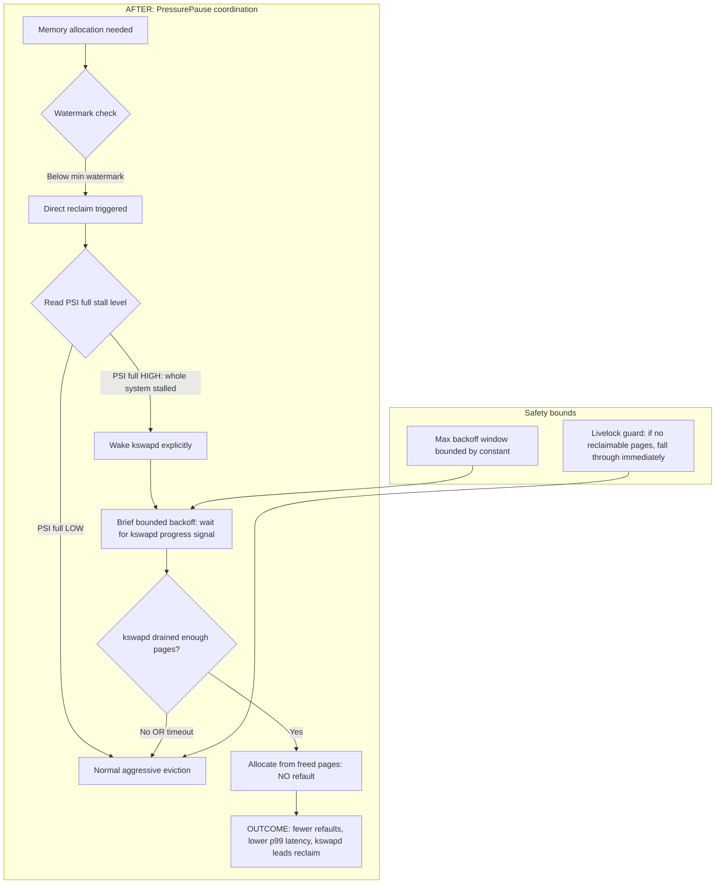
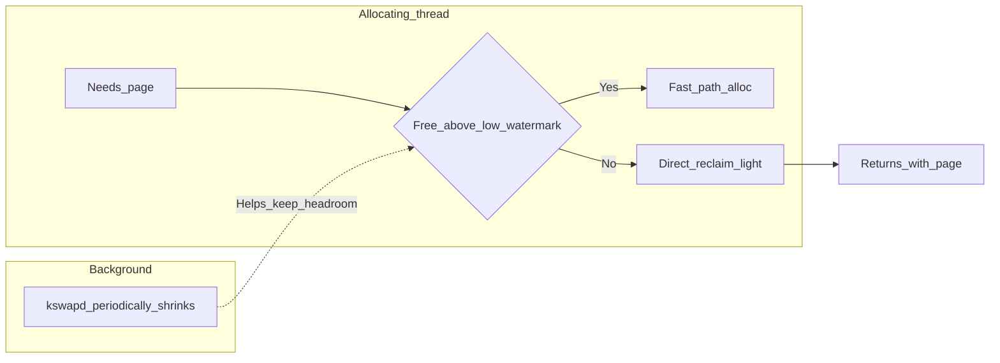
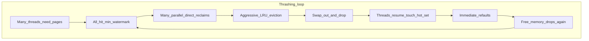
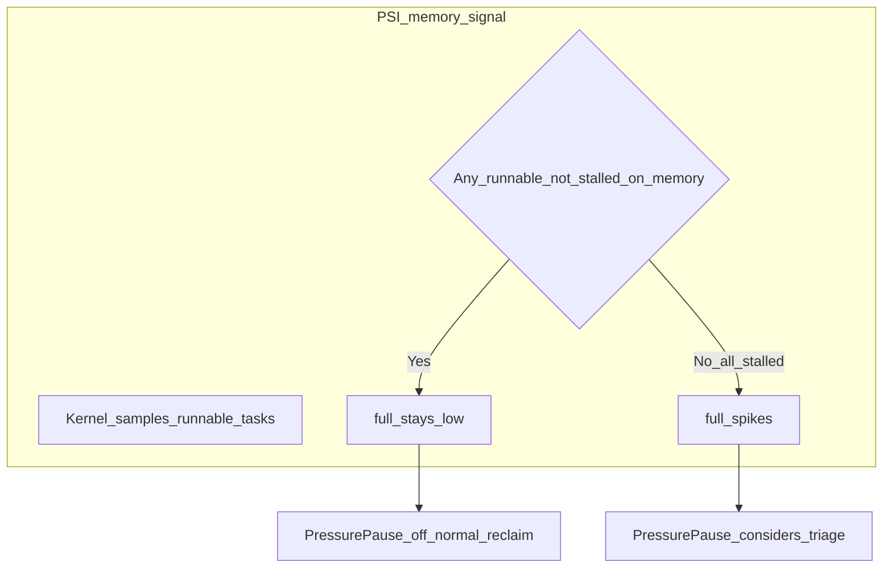
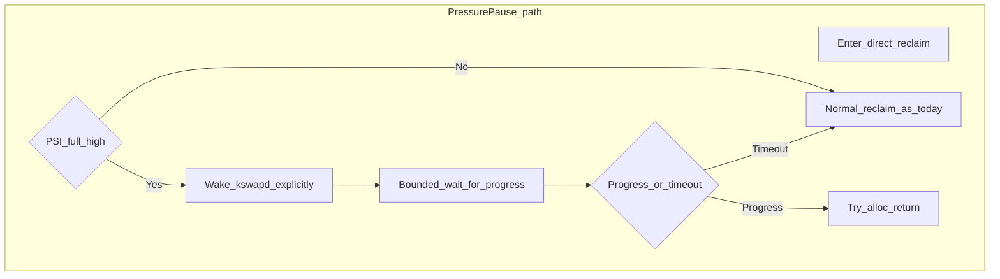
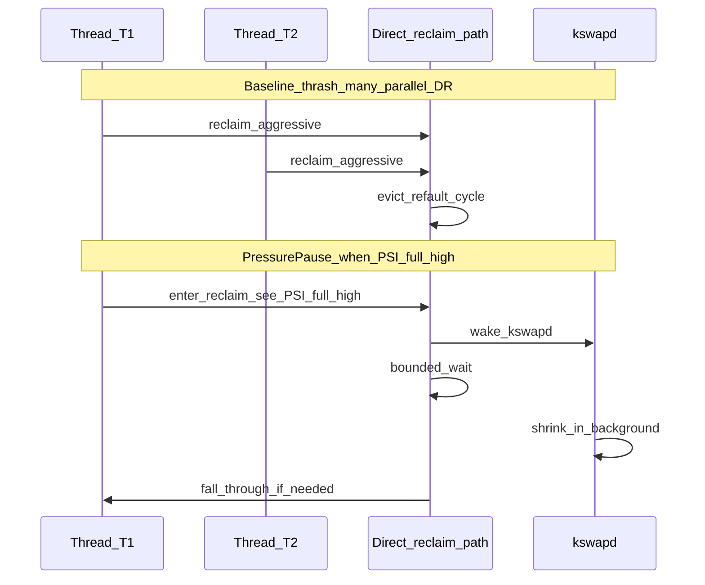
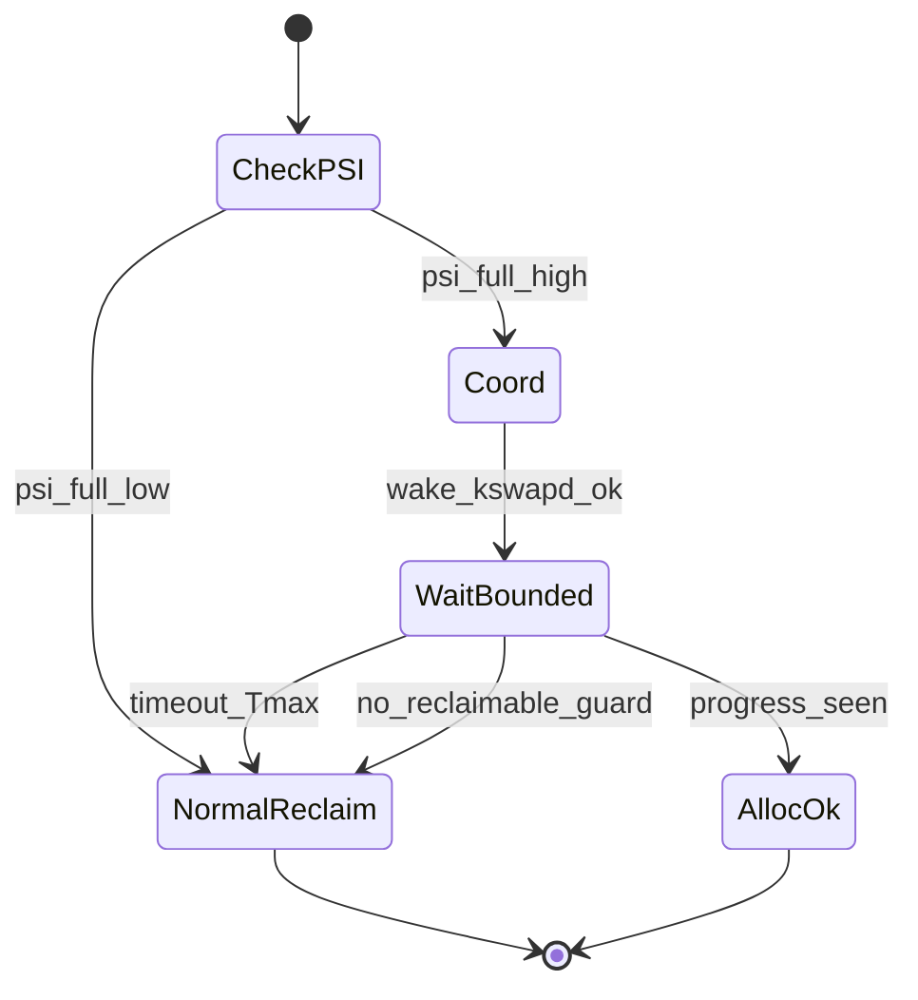

# CS325 Project — Idea 3: PressurePause Reclaimer

**Kernel component (course list):** Page replacement / reclaim behavior (extends the “page replacement algorithm” item by coordinating **direct reclaim** with **system-wide stall pressure**).

**One-line thesis:** Linux direct reclaim can keep evicting under coordinated memory thrash even when the whole system is stalled; a bounded, PSI-aware pause that wakes `kswapd` and yields briefly can cut refault churn and improve tail latency without abandoning forward progress.

---

## 1. What you are building (plain language)

When RAM is tight, user threads sometimes enter **direct reclaim**: they block and the kernel tries to free pages immediately. If the machine is already in a **global stall** (everyone waiting on memory), more aggressive eviction from many threads at once tends to cause **refaults** and **swap storms** instead of clean progress.

**PressurePause** adds a **coordination signal** on the reclaim path:

- When direct reclaim starts and **PSI “full”** (memory) indicates a **whole-system stall window**, you **do not** blindly do the same eviction intensity as in normal pressure.
- You **wake `kswapd` explicitly** (if not already aggressive enough) and apply a **short, bounded backoff** so background reclaim can drain some backlog **once**, then either **allocate from freed memory** or **time out and fall through** to normal direct reclaim.

This is **not** “sleep forever” and **not** disabling reclaim; it is **stall-triggered triage** with hard caps.

---

## 2. Problem statement (for report § motivation)

| Aspect | Detail |
|--------|--------|
| **Symptom** | High `si`/`so`, rising major faults, UI/workload freezes, exploding p99 latency under RAM overcommit. |
| **Mechanism** | Many tasks in direct reclaim compete; evicted pages are immediately touched again (working set > RAM). |
| **Gap** | Direct reclaim lacks a cheap **system-wide** “we are thrashing together” signal; `kswapd` and direct reclaim are poorly coordinated under extreme pressure. |
| **Hypothesis** | During high PSI-full windows, a **bounded** deferral that **prefers `kswapd`-led** reclaim reduces useless churn and refaults. |

Evidence anchors from your research doc: R45 (direct reclaim latency), R46 (`kswapd` wakeup behavior), R48 (swap storms), R49 (PSI full as thrash indicator), R51–R52 (reclaim variability).

---

## 3. BEFORE / AFTER (conceptual)

### BEFORE: blind direct reclaim under pressure

```mermaid
flowchart TD
    subgraph before3 [BEFORE: Blind direct reclaim under pressure]
        A3[Memory allocation needed] --> B3{Watermark check}
        B3 -->|Below min watermark| C3[Direct reclaim: user task blocks]
        C3 --> D3[Evict LRU pages aggressively]
        D3 --> E3[Pages written to swap]
        E3 --> F3[Allocation satisfied temporarily]
        F3 --> G3[Same pages refaulted immediately]
        G3 --> H3[Direct reclaim again: vicious cycle]
        H3 --> I3[OUTCOME: swap storm, system near-unresponsive, p99 latency explodes]
    end
    subgraph kswapd3b [kswapd: lagging behind, not coordinated]
        KS3[kswapd running independently] --> KS4[Cannot signal direct reclaimers to wait]
        KS4 --> KS5[Direct and background reclaim compete, thrash together]
    end
```

### AFTER: PressurePause coordination

---

## 4. Design sketch (implementation-facing)

**Where:** Start from direct reclaim entry (ideas doc: `mm/vmscan.c` — e.g. paths around `shrink_node()` / reclaim invoked from allocation slowpath). You will need the **exact** symbol for your chosen kernel version after you clone trees.

**Signal:** Read-only use of existing PSI APIs (`kernel/sched/psi.c`, `include/linux/psi_types.h`). Do **not** reimplement PSI.

**Control flow (pseudocode):**

1. Enter direct reclaim for this allocation / node.
2. If **PSI memory full** (or your chosen threshold) **below** threshold → **unchanged** behavior.
3. If **above** threshold:
   - Ensure `kswapd` is woken for this node (use existing helpers; do not invent a second kswapd).
   - Record start time / generation counter.
   - **Bounded** wait loop or short schedule: exit when (a) enough free pages / watermarks improved, (b) **timeout** T_max elapsed, or (c) **no reclaimable pages** livelock guard fires.
4. If still under pressure → fall through to **normal** direct reclaim (original code path).

**Tuning knobs (constants / sysfs later, not required day one):** PSI threshold, T_max, “enough progress” definition (e.g. zone free pages delta).

---

## 5. Safety invariants (must appear in report + demo Q&A)

1. **No indefinite blocking:** Backoff ≤ **T_max** (fixed constant or jiffies-derived cap).
2. **Do not replace reclaim:** You still allow **full** direct reclaim after timeout or if guards trip.
3. **`kswapd` cooperation:** Waking `kswapd` is **in addition** to eventual reclaim, not “hope and return NULL” forever.
4. **Livelock / OOM:** If the kernel reports **no reclaimable** memory or progress stalls, **immediately** take the normal reclaim path so OOM killer logic can still run as today.
5. **Locking:** Reclaim already runs under delicate locks; any wait must use **existing** wait primitives compatible with the call context (this is the hardest part — validate **where** you are allowed to sleep).

---

## 6. Identification of kernel component (report § “identification”)

Suggested narrative for the marker:

1. Trace **page allocation slowpath** from `__alloc_pages*` → memory pressure handling → **direct reclaim** invocation.
2. Show **LRU / shrinker** path in `mm/vmscan.c` and how **watermarks** trigger reclaim.
3. Contrast **`kswapd`** (background) vs **direct reclaim** (foreground, in allocating context).
4. Show **PSI** as accounting layer for **stall time** (`/proc/pressure/memory`, `some` vs `full`).

Screenshots: `cscope`/`vim` jump list, or IDE symbol search, with **file:line** for your kernel tag.

---

## 7. “Alternative methodology” (report § requirement)

Present at least two designs and justify yours:

| Approach | Pros | Cons |
|----------|------|------|
| **A. PSI-gated backoff (chosen)** | Uses existing kernel signal; small surface; clear story for Week 9 | Must prove no regressions; lock context constraints |
| **B. Fixed throttle / sleep in reclaim** | Simple | Blind to real pressure; can delay OOM/recovery incorrectly |
| **C. User-space only (swapiness, cgroups)** | No kernel patch | Fails course “modify kernel” requirement |

---

## 8. Evaluation criteria and benchmarks (report § results)

**Environment:** QEMU or Hyper-V VM, **512 MB–1 GB RAM**, swap enabled, **same** image for baseline vs patched kernel.

**Workloads (pick 2–3):**

- `stress-ng --vm 2 --vm-bytes 80%` (tune to force reclaim).
- Large heap + random touch exceeding RAM (custom C program or `stress-ng`).
- Optional: file cache + DB-style if time permits.

**Metrics (before vs after):**

| Metric | How to collect |
|--------|----------------|
| Swap I/O | `vmstat 1` → `si`, `so` |
| Major faults | `/proc/vmstat` → `pgmajfault` (delta over run) |
| Stall pressure | `/proc/pressure/memory` → `full avg10` (or total) |
| Reclaim CPU | `perf stat` on VM scan functions / overall CPU |
| Tail latency | simple allocator microbench + `ftrace` timestamps or `perf` |

**Success criteria (honest):** Same or better **mean** throughput is nice, but the **claim** is about **refault / swap storm reduction** and **p99** allocation or stall indicators — document **regressions** too.

---

## 9. Build, boot, demo checklist (report § steps + screenshots)

1. Install build deps (distribution package list for kernel build).
2. Download **specific** stable kernel version (record **commit/tag**).
3. Apply patch; `make olddefconfig` → enable any options you need for PSI (usually on for modern configs).
4. Build kernel + modules; install; update bootloader inside VM.
5. Boot **baseline** → capture `uname -r`, benchmark log.
6. Boot **patched** → same scripts, same VM shape.
7. Demo: side-by-side `vmstat` + pressure file + one workload; explain **one** code hunk on screen.

---

## 10. Suggested team split (≤ 4 members)

| Area | Tasks |
|------|--------|
| **Trace / patch** | Allocation → reclaim path; implement gated backoff; resolve sleep/lock issues |
| **PSI / measurement** | Scripts for `/proc/pressure`, `vmstat`, `perf`; graph results |
| **Integration** | Kernel build pipeline, VM images, reproducible benchmark shell |
| **Report + demo** | Rubric sections, diagrams, Q&A on invariants |

Every member should be able to explain **watermarks**, **direct vs kswapd**, and **why bounded wait**.

---

## 11. Report skeleton (aligns with CS325-Project.md)

1. **Introduction** — problem, thesis, scope (page replacement / reclaim).
2. **Environment** — distro, kernel version, VM specs, tools.
3. **Kernel build & boot** — steps + screenshots.
4. **Component identification** — call graph, key symbols, files.
5. **Design** — BEFORE/AFTER, alternative methods, your choice.
6. **Implementation** — patch description, key data structures, constants.
7. **Correctness & safety** — invariants, failure modes, livelock/OOM.
8. **Evaluation** — methodology, tables/graphs, discussion (including negative results).
9. **Conclusion** — what worked, what to extend, lessons.

---

## 12. References (starter set)

- Linux PSI: https://www.kernel.org/doc/html/latest/accounting/psi.html  
- Reclaim overview: https://kernel-internals.org/mm/reclaim/  
- Course research anchors: R41–R58 in `CS325-70plus-Research-Analysis.md`  
- Original idea spec: Idea 3 in `CS325-Unique-Kernel-Project-Ideas.md`

---

## 13. Risk register (use in proposal / weekly log)

| Risk | Mitigation |
|------|------------|
| Sleeping in wrong reclaim context | Prototype in lowest-risk callsite; read lockdep / call traces |
| No measurable win | Narrow workload; report honestly; adjust thresholds |
| Regression on small RAM VMs | Compare OOM latency; ensure fall-through |
| Time | Ship minimal threshold + timeout first; polish second |

---

## 14. Deep scenarios and diagrams (teaching / report appendix)

Use this section for slides, demo narrative, and marker Q&A. Diagrams follow the same mermaid style as §3.

### 14.1 Cast of characters (who does what)

| Actor | Role |
|--------|------|
| **User thread** | Needs pages (`malloc`, stack, `mmap`, …). Below watermarks it may **block** in the kernel. |
| **Page allocator** | Checks **free pages** vs **watermarks** (high / low / min) per **zone**. |
| **`kswapd`** | Background thread: proactive reclaim before catastrophe. |
| **Direct reclaim** | **Synchronous** reclaim in the **allocating** context until enough pages exist or failure. |
| **PSI (memory)** | Measures **stall time** waiting on memory. **`some`** = some tasks stalled; **`full`** = all sampled runnable tasks stalled → strong hint of **coordinated thrash**. |

### 14.2 Scenario A — Mild pressure (no PressurePause change)

Normal path: one thread may hit reclaim; others still run. PSI **`full`** stays low → gate stays **off**; behavior matches stock kernel.

### 14.3 Scenario B — Thrash storm (the problem)

VM with constrained RAM; working set **larger than RAM**. Many threads enter **parallel** direct reclaim, evict pages still in someone’s working set → **immediate refaults** and **swap churn**. `kswapd` alone cannot prevent synchronous reclaim from piling on.

### 14.4 Scenario C — PSI as the “weather report”

PSI does not allocate; it **accounts stall time**. **`full` high** ≈ “everyone runnable is stuck on memory” → good moment to **triage** direct reclaim instead of everyone evicting blindly.

### 14.5 Scenario D — PressurePause happy path (idea)

On direct reclaim entry: if **`full`** high → **wake `kswapd`**, **bounded** wait for progress; on progress → allocate; on **timeout** or **no reclaimable** guard → **fall through** to normal reclaim (unchanged stock behavior).

### 14.6 Scenario E — Multi-thread timeline (conceptual)

### 14.7 Scenario F — Safety states (invariants)

### 14.8 Map scenarios to report sections

| Doc section | Scenarios |
|-------------|-----------|
| §1–2 Problem / thesis | §14.3, §14.4 |
| §3 BEFORE/AFTER | §14.3 vs §14.5 |
| §4 Design | §14.5, §14.7 |
| §5 Safety | §14.7, §14.7 `timeout` / `no_reclaimable` |
| §8 Evaluation | Reproduce §14.3 in VM; measure `vmstat`, `/proc/pressure/memory`, `/proc/vmstat` |

### 14.9 Scope honesty (for conclusions)

PressurePause is a **heuristic**; document workloads where **`full`** aligns with thrash and where results are **neutral or negative**. Negative results are acceptable if methodology is sound.

---

*This document expands **Idea 3: PressurePause Reclaimer** into a course-ready project brief. Adjust function names and line targets to match the exact kernel tree you build after `CS325-Project.md` timeline.*
