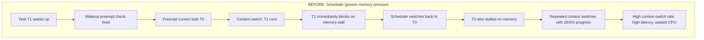
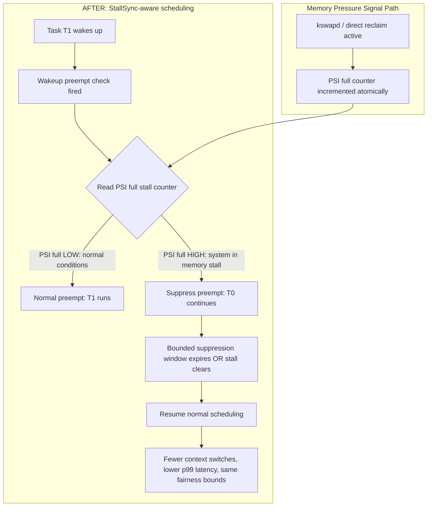
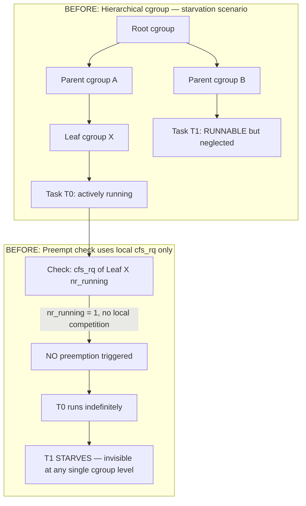
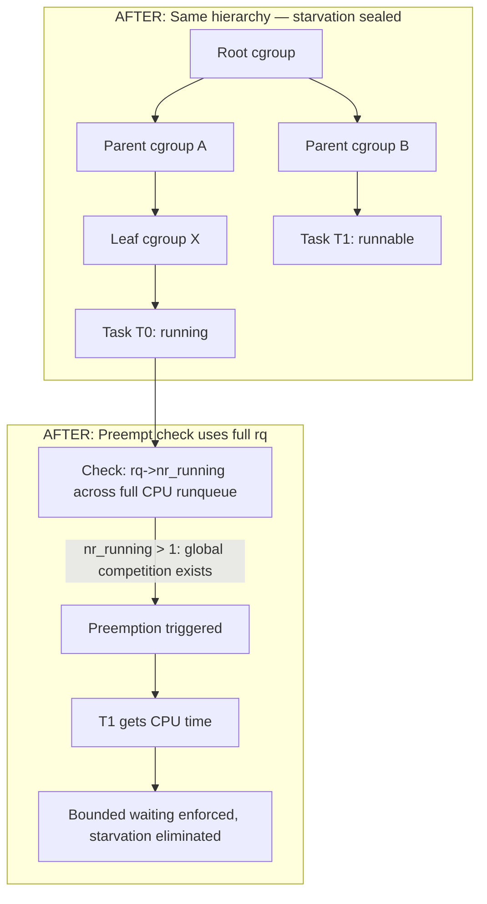
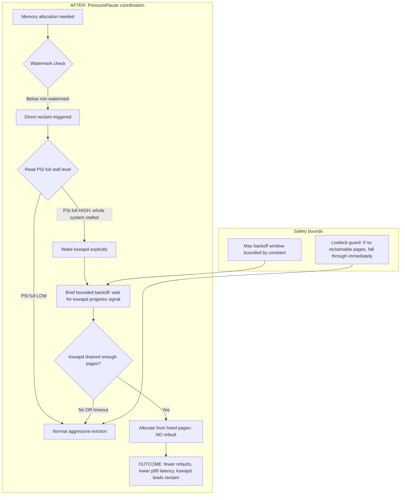
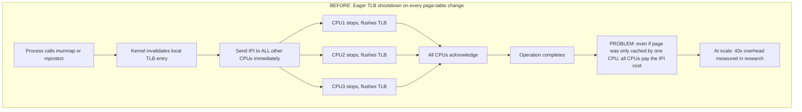
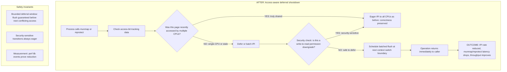
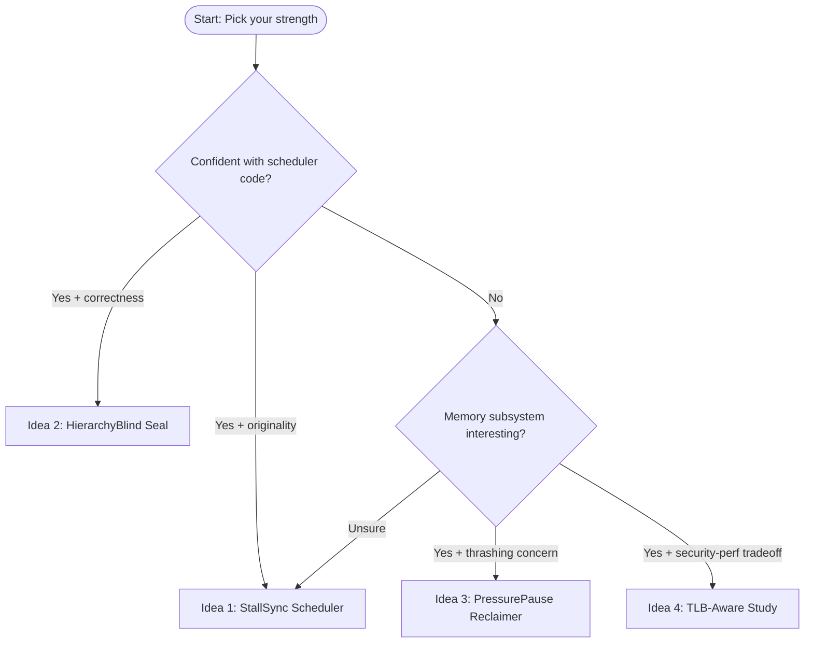

```mermaid
flowchart TD
    subgraph before3 [BEFORE: Blind direct reclaim under pressure]
        A3[Memory allocation needed] --> B3{Watermark check}
        B3 -->|Below min watermark| C3[Direct reclaim: user task blocks]
        C3 --> D3[Evict LRU pages aggressively]
        D3 --> E3[Pages written to swap]
        E3 --> F3[Allocation satisfied temporarily]
        F3 --> G3[Same pages refaulted immediately]
        G3 --> H3[Direct reclaim again: vicious cycle]
        H3 --> I3[OUTCOME: swap storm, system near-unresponsive, p99 latency explodes]
    end
    subgraph kswapd3b [kswapd: lagging behind, not coordinated]
        KS3[kswapd running independently] --> KS4[Cannot signal direct reclaimers to wait]
        KS4 --> KS5[Direct and background reclaim compete, thrash together]
    end
```

# Unique CS325 Kernel Project Ideas (In-Depth)

All ideas target the allowed components from [CS325-Project.md](/home/cipher/Downloads/project%20os/CS325-Project.md) and are anchored in findings from [CS325-70plus-Research-Analysis.md](/home/cipher/Downloads/project%20os/CS325-70plus-Research-Analysis.md).

**Environment:** VM (QEMU / Hyper-V), balanced risk.

---

## Idea 1: StallSync Scheduler (CPU Scheduling + Memory Pressure Feedback)

### Unique One-Line Thesis
> The Linux CFS/EEVDF scheduler is unaware of system-wide memory stall pressure, causing harmful preemption churn that increases task latency without throughput gain during coordinated memory thrash phases.

### The Problem (What Nobody Else Targets)
Standard scheduler projects optimize for CPU-bound or wakeup-latency workloads. This idea addresses a **real observed failure mode**: when the whole system enters a memory-pressure "full stall" state (measurable via PSI), the scheduler keeps firing context switches between tasks that are all waiting on memory — generating overhead with zero forward progress. This wastes CPU on scheduling bookkeeping at exactly the wrong time.

**Evidence anchors (from research file):**
- R01/R02: scheduler complexity can hide non-CPU failure modes
- R44/R45: direct reclaim and vmscan stalls can paralyze user tasks
- R49: PSI "full" signal reliably indicates coordinated memory stall
- R78: patching one dimension (latency) can regress another — evaluating across dimensions is required

### BEFORE: Current Kernel Behavior (The Problem)

### AFTER: Your Modification (The Fix)

### Kernel Files to Touch
- `kernel/sched/fair.c` — wakeup preemption decision point
- `kernel/sched/core.c` — schedule() hot path
- `include/linux/psi_types.h` + `kernel/sched/psi.c` — PSI signal read path

### Syllabus Map
- Week 4: scheduling criteria — throughput, response time, utilization
- Week 5-8: bounded waiting, progress guarantees, no starvation argument
- Week 9: memory pressure behavior as external signal

### Safety Invariants You Must Defend
- No task may be permanently suppressed; upper bound on suppression window (e.g., 2 × time-slice)
- PSI read must be lock-free or use existing exported atomic read path
- Starvation: any suppressed task must be guaranteed a run within a bounded interval

### Benchmark Plan (QEMU/Hyper-V)
- Baseline kernel boot → run stress workload
- Modified kernel boot → same workload
- Workloads: `stress-ng` memory + CPU mix, `hackbench`, latency probe loop
- Metrics: `vmstat`, `/proc/pressure/memory`, `perf stat`, `/proc/interrupts` context-switch count, `cyclictest` p99

### References
- R01-R20 (scheduler), R44-R58 (reclaim), R49 (PSI full)
- LKML EEVDF preempt-fix discussions 2024
- EuroSys "Wasted Cores" paper
- Linux PSI docs: `https://www.kernel.org/doc/html/latest/accounting/psi.html`

---

## Idea 2: HierarchyBlind Starvation Seal (Cgroup-Aware Scheduling Fix)

### Unique One-Line Thesis
> Under nested cgroup configurations, EEVDF's local-cfs_rq preemption check can make a task "locally idle" but globally neglected — producing starvation not detectable at any single cgroup level.

### The Problem (What Nobody Else Targets)
A documented 2024 LKML RFC showed that when nested cgroup hierarchies exist, the preemption eligibility check `cfs_rq->nr_running` only inspects the leaf queue. A task at a parent level can be runnable but never considered because the leaf queue sees no competing task. This is a **hierarchical correctness failure**, not a performance bug — and it maps directly to your Week 4 fairness + Weeks 7-8 deadlock-avoidance theory.

**Evidence anchors:**
- R06: cgroup starvation from local-only nr_running check
- R07: incorrect vruntime_normalized check causing starvation in stable kernels
- R19: cgroup hierarchy introduces non-obvious edge cases absent in single-queue theory
- R37/R38: deadlock and starvation avoidance require globally consistent logic

### BEFORE: Current Kernel Behavior (The Bug)

### AFTER: Your Modification (The Fix)

### Kernel Files to Touch
- `kernel/sched/fair.c` — one function, one conditional change (high precision, low risk)
- Optional: add `ftrace`/`tracepoint` to record when this suppressed preemption fires

### Syllabus Map
- Week 2-3: process/thread scheduling state model
- Week 4: multilevel queue scheduling theory
- Week 7-8: deadlock and bounded-waiting arguments
- Week 1: kernel module structure and hierarchy

### Safety Invariants You Must Defend
- The wider check must not cause excessive preemption when the extra runnable task is ineligible (RT class, sleeping, etc.)
- Fairness must be measurable — show that without the fix, global fairness degrades; with fix, it recovers

### Benchmark Plan (QEMU/Hyper-V)
- Create nested cgroup hierarchy in VM (systemd slices or manual cgroupfs)
- Run task in leaf cgroup alongside tasks at parent level
- Measure: scheduling latency of neglected task, cgroup CPU usage, response time
- Repeat: baseline kernel vs patched kernel under identical setup

### References
- R06, R07, R19 (cgroup starvation evidence)
- LKML RFC: Tobias Huschle, February 2024 — sched/eevdf: avoid task starvation in cgroups
- Linux kernel EEVDF docs: `https://docs.kernel.org/scheduler/sched-eevdf.html`
- Lockdep design docs for lock-class reasoning reference (analogy to hierarchy-local vs global view)

---

## Idea 3: PressurePause Reclaimer (Page Replacement + Stall-Triggered Triage)

### Unique One-Line Thesis
> Linux direct reclaim blindly evicts pages even when the system is in a "whole-system stall" state, accelerating refaults instead of pausing and allowing kswapd to drain the backlog — the reclaim path lacks a coordination signal.

### The Problem (What Nobody Else Targets)
When kswapd is behind and tasks enter direct reclaim, they compete instead of coordinate. Under high memory pressure, direct reclaim churns through evictions that immediately refault because the working set exceeds available RAM. The insight: **a brief adaptive throttle during high-PSI "full" windows** — not a sleep, but a reclaim-path signal — can reduce refault rate and improve system-wide latency without breaking any safety property.

**Evidence anchors:**
- R45: direct reclaim causes latency spikes when user tasks block
- R46: kswapd wakeup misfires leave tasks stuck in throttle path
- R48: swap storms are a direct symptom of reclaim mismatch
- R49: PSI "full" is reliable thrash indicator
- R51-R52: MGLRU variability evidence shows even modern reclaim is not robust

### BEFORE: Current Kernel Behavior (The Problem)

### AFTER: Your Modification (The Fix)

### Kernel Files to Touch
- `mm/vmscan.c` — `shrink_node()` or `reclaim_pages()` entry point
- `kernel/sched/psi.c` — existing PSI read API (read-only use)
- `include/linux/psi_types.h` — struct reference only

### Syllabus Map
- Week 9: page replacement, swapping, reclaim behavior (primary)
- Week 5-8: lock correctness in reclaim path (secondary safety argument)
- Week 4: process blocking behavior during direct reclaim (indirect)

### Safety Invariants You Must Defend
- Backoff must have an absolute maximum duration — no task may block indefinitely
- kswapd cooperation: your change must explicitly wake kswapd before backing off, not instead of reclaiming
- Must not create a livelock: if kswapd cannot make progress (no reclaimable pages), direct reclaim falls through normally

### Benchmark Plan (QEMU/Hyper-V)
- VM with constrained RAM (e.g., 512MB–1GB), swap enabled
- Load: `stress-ng --vm`, large matrix computation, or database replay that exceeds RAM
- Metrics: `vmstat si/so`, `/proc/vmstat pgmajfault`, `/proc/pressure/memory`, `perf stat` cache misses
- Compare: refault rate, p99 allocation latency, kswapd vs direct-reclaim CPU split

### References
- R41-R58 (reclaim and thrashing evidence)
- Linux kernel reclaim docs: `https://kernel-internals.org/mm/reclaim/`
- PSI docs: `https://www.kernel.org/doc/html/latest/accounting/psi.html`
- MGLRU characterization: Yale/Loyola 2024 study

---

## Idea 4: TLB-Aware Page Table Policy Study (Page Table + Isolation Cost Measurement)

### Unique One-Line Thesis
> Page-table level granularity (how many levels and when huge pages are used) directly affects TLB pressure and shootdown cost — but Linux makes no workload-aware adjustment to this decision, creating unnecessary overhead for predictable access patterns.

### The Problem (What Nobody Else Targets)
Students avoid page-table projects because they seem "only security." This idea reframes it: **TLB shootdown overhead is a scalability drawback of uncontrolled page-table state** (not Meltdown). Research shows TLB invalidation can reduce performance by 40x in pathological cases. Your project measures how table-granularity choices and flush frequency interact, then applies a minimal toggle.

**Evidence anchors:**
- R64: TLB shootdowns are a documented scalability bottleneck
- R65: reduction techniques cut invalidations by up to 98% in academic work
- R66: lazy/coherence strategies improve performance but need correct barrier ordering
- R67: mremap/flush-timing races show stale translation windows exist
- R75: hardware feature differences (PCID, ASID) change cost significantly
- R76: a page-table project must report both security and cost dimensions

### BEFORE: Current Kernel Behavior (The Overhead)

### AFTER: Your Modification (Selective / Batched Shootdown)

### Kernel Files to Touch
- `arch/x86/mm/tlb.c` — TLB flush and shootdown logic
- `mm/mprotect.c` / `mm/mremap.c` — where shootdowns are triggered
- Architecture-agnostic path: `mm/memory.c` — page-table walk instrumentation

### Syllabus Map
- Week 9: address translation, TLB, page-table hierarchy, EAT calculation (primary)
- Week 1: OS architecture and kernel subsystem structure
- Week 5-8: IPIs and cross-CPU coordination as a synchronization correctness problem

### Safety Invariants You Must Defend
- Deferred/batched shootdown must guarantee coherence before any subsequent conflicting access
- Must not permit stale TLB entries to service security-sensitive (mprotect write→read downgrade) transitions
- Any deferral window must be bounded and measurable

### Benchmark Plan (QEMU/Hyper-V)
- Multi-vCPU VM (4+ vCPUs)
- Workloads: repeated `mprotect` loops, `mremap` at scale, `munmap` heavy allocator pattern
- Metrics: `perf stat -e tlb:*`, `/proc/interrupts` (IPI count), `time munmap`-heavy workload
- Compare: baseline vs instrumented/modified kernel shootdown counts and wall times

### References
- R59-R76 (page-table and TLB evidence)
- USENIX ATC 2017: Amit — TLB shootdown with page access tracking
- USENIX ATC 2024: Hydra — NUMA page-table replication paper
- ASPLOS 2018: Latr — lazy TLB shootdown
- Linux cache/TLB flush docs: `https://www.kernel.org/doc/html/v5.15/core-api/cachetlb.html`
- EntryBleed / KPTI: `https://dl.acm.org/doi/fullHtml/10.1145/3623652.3623669`

---

## Selection Guide

## Recommended pick for this team
**Idea 1 (StallSync Scheduler)** if you want the strongest cross-layer narrative.  
**Idea 3 (PressurePause Reclaimer)** if you want the strongest Week 9 depth.

---

## Next Step After Confirming One Idea
The implementation plan will include:
- exact function names and line-range targets inside kernel source
- build + boot + snapshot playbook for QEMU/Hyper-V
- complete benchmark command suite with expected output format
- rubric-aligned report section skeleton (functionality/report/demo)
