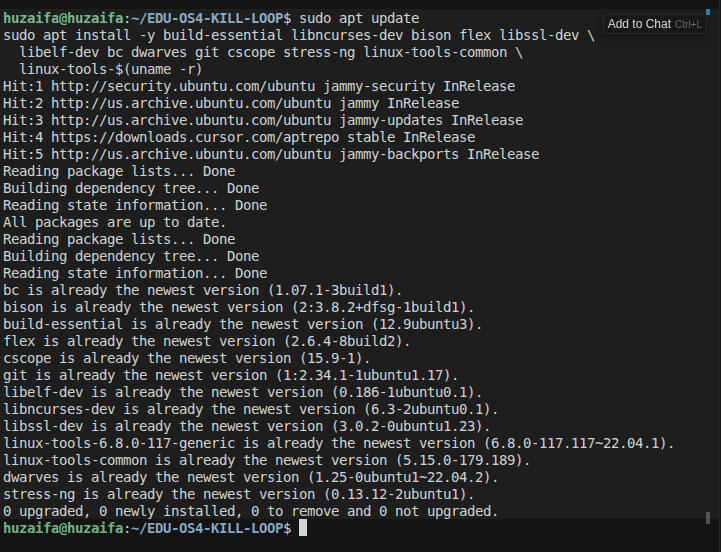
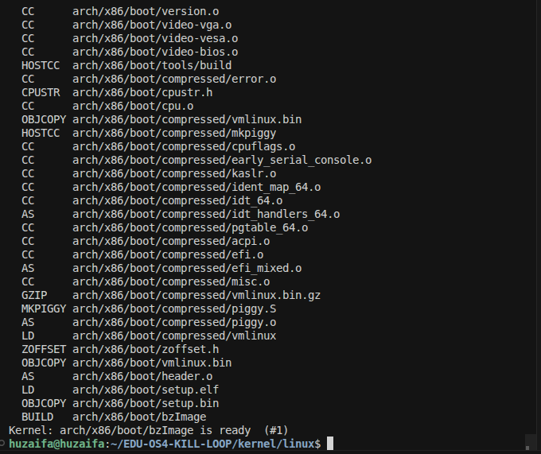
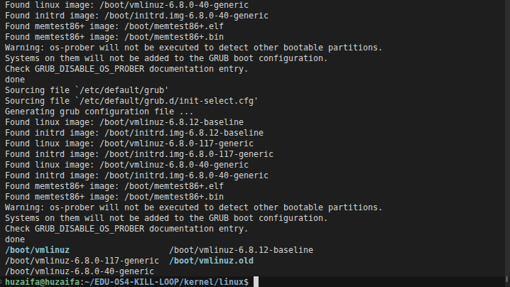
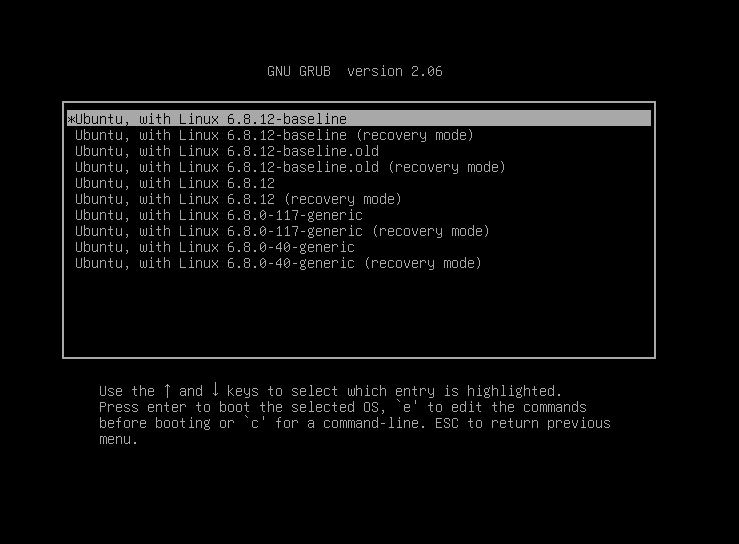
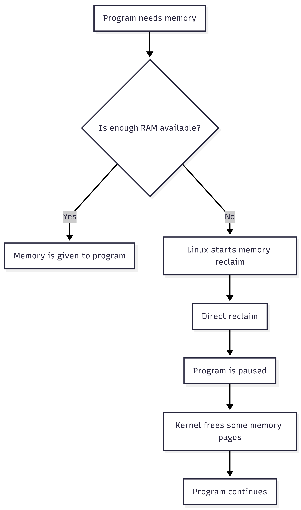
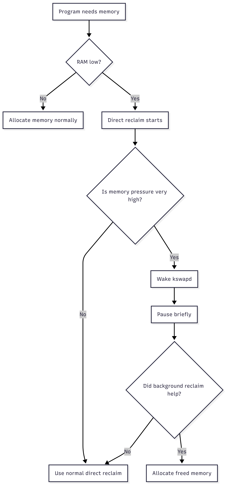
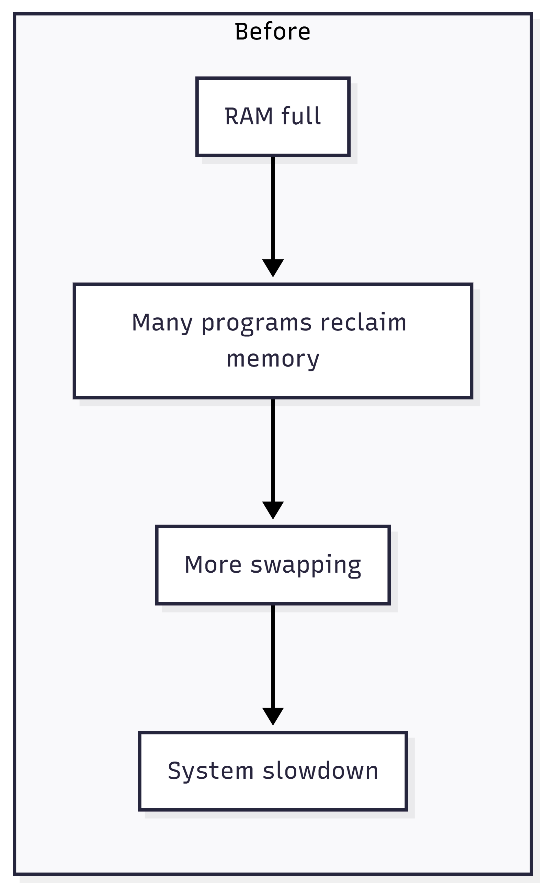
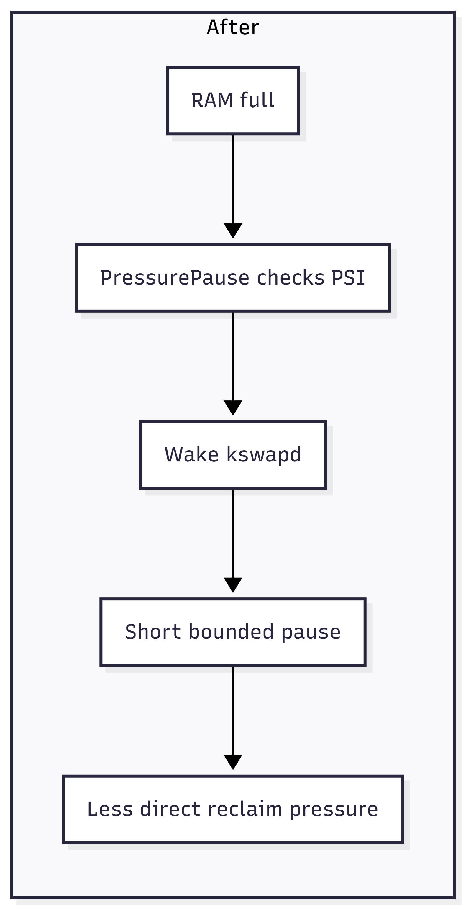
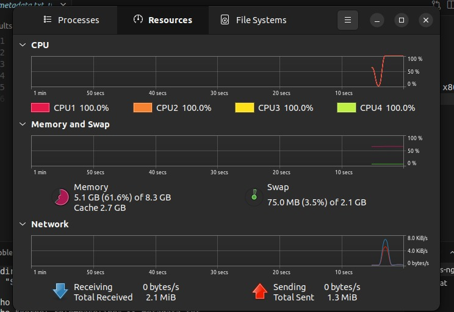
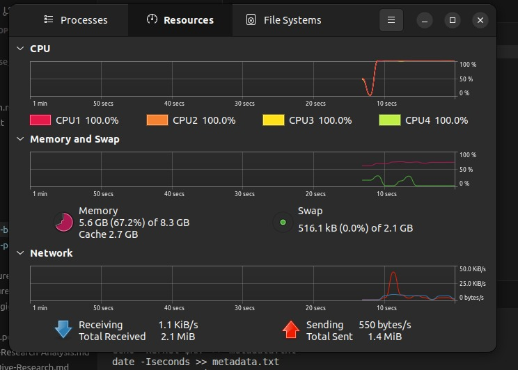

# Modification of Linux OS Kernel: PSI-Gated Memory Reclaim Coordination

CS325 Operating Systems semester project for Linux kernel modification.

**Feature name:** PressurePause  
**Kernel:** Linux v6.8.12  
**Custom kernels:** `6.8.12-baseline` and `6.8.12-pressurepause+`  
**Selected OS component:** Page replacement / memory reclaim  
**Main report:** [Report.pdf](Report.pdf)  
**LaTeX source:** [Report.tex](Report.tex)  
**Assignment brief:** [CS325 Project - Sir Imran.pdf](CS325%20Project%20-%20Sir%20Imran.pdf)

## Project Overview

PressurePause is a Linux kernel modification that adds a bounded, PSI-aware coordination step before direct page reclaim. When memory pressure is detected through PSI `some` avg10, the allocating thread wakes `kswapd`, waits briefly for background reclaim progress, and then always falls back to the stock `shrink_zones()` reclaim loop.

The goal is not to replace Linux reclaim. The goal is to reduce reclaim storms under memory pressure by coordinating foreground direct reclaim with background reclaim.

## CS325 Requirement Coverage

| Requirement from project brief | Covered by this repository |
| --- | --- |
| Select a core OS kernel component | Page replacement / memory reclaim |
| Identify the component in Linux source | `mm/vmscan.c`, `mm/page_alloc.c`, PSI files |
| Modify Linux kernel source | PressurePause patch in reclaim path |
| Recompile and boot custom kernel | Baseline and patched boot screenshots included |
| Evaluate before vs after performance | Benchmark results under `results/` and report table |
| Include screenshots in report | Build, boot, debugfs, and benchmark screenshots in `images/` |

## Repository Layout

| Path | Purpose |
| --- | --- |
| `Report.tex` | Full LaTeX report source |
| `Report.pdf` | Final compiled report |
| `kernel/linux/` | Vendored Linux v6.8.12 source tree |
| `kernel/patches/0001-pressurepause.patch` | Main PressurePause kernel patch |
| `kernel/configs/` | Saved baseline and patched kernel configs |
| `scripts/` | Install, verification, and benchmark helper scripts |
| `results/` | Baseline and patched benchmark outputs |
| `images/` | Report screenshots and benchmark images |
| `docs/` | Supporting notes and component identification |

## Development Environment

The report was prepared and tested with:

- Ubuntu 22.04, x86_64
- Linux v6.8.12 source tree
- GCC build toolchain
- `stress-ng` for memory pressure workloads
- `vmstat`, `pgmajfault`, PSI samples, and debugfs counters for evaluation

Configuration evidence from the saved configs:

| Kernel | `CONFIG_PSI` | `CONFIG_DEBUG_FS` |
| --- | --- | --- |
| `6.8.12-baseline` | not set in saved defconfig | `y` |
| `6.8.12-pressurepause+` | `y` | `y` |

The baseline comparison uses common `vmstat`, swap, and page-fault metrics. PSI/debugfs counters are used as patched-kernel activation evidence.

## Build and Boot Summary

Install build dependencies:

```bash
sudo apt update
sudo apt install -y build-essential libncurses-dev bison flex libssl-dev \
  libelf-dev bc dwarves git cscope stress-ng linux-tools-common \
  linux-tools-$(uname -r)
```

Clone or prepare Linux v6.8.12:

```bash
git clone --depth 1 --branch v6.8.12 https://git.kernel.org/pub/scm/linux/kernel/git/stable/linux.git kernel/linux
cd kernel/linux
make defconfig
```

Build the custom baseline:

```bash
make -j2 LOCALVERSION=-baseline
sudo make modules_install
sudo make install
sudo update-grub
```

Build and install the patched PressurePause kernel:

```bash
cd kernel/linux
scripts/config --enable PSI
scripts/config --enable DEBUG_FS
scripts/config --set-str LOCALVERSION "-pressurepause"
make olddefconfig
make -j2
cd ../..
./scripts/install-pressurepause-kernel.sh
```

After reboot, verify with:

```bash
uname -r
```

Expected kernels:

- `6.8.12-baseline`
- `6.8.12-pressurepause+`

## Source Identification

PressurePause is implemented in the page reclaim path.

Main modified kernel files:

- `include/linux/psi.h`
- `kernel/sched/psi.c`
- `mm/vmscan.c`

Related upstream path, not directly modified:

- `mm/page_alloc.c`

Allocator to reclaim call graph:

```text
__alloc_pages_slowpath
  -> wake_all_kswapds
  -> __alloc_pages_direct_reclaim
    -> psi_memstall_enter
    -> __perform_reclaim
      -> try_to_free_pages
        -> do_try_to_free_pages
          -> pressure_pause_maybe
          -> shrink_zones
            -> shrink_node
              -> LRU shrink / swap
```

The hook is placed in `do_try_to_free_pages()` before the normal `shrink_zones()` priority loop. This limits the change to foreground direct reclaim and avoids modifying the shared `shrink_node()` path used by both direct reclaim and `kswapd`.

## PressurePause Design

PressurePause uses memory PSI as a signal that the system is under memory stall pressure.

Core behavior:

1. Enter `pressure_pause_maybe()` from `do_try_to_free_pages()`.
2. Skip cgroup reclaim paths.
3. Read system PSI `some` and `full` avg10 values.
4. Gate activation on PSI `some` avg10 using a fixed-point basis-point comparison.
5. Check that reclaimable pages exist.
6. Check that at least one managed zone is below min watermark.
7. Wake `kswapd`.
8. Increment debugfs activation counters.
9. Wait up to 20 ms.
10. Always return to the normal stock reclaim path.

Important safety properties:

- The pause is bounded to 20 ms.
- The patch never disables reclaim permanently.
- The stock `shrink_zones()` path always runs after the hook.
- The patch skips cgroup reclaim.
- The patch avoids waiting when no reclaimable pages exist.
- Debugfs counters expose whether the path actually ran.

## Alternative Methodologies Considered

| Method | Summary | Reason |
| --- | --- | --- |
| PSI-gated backoff | Chosen approach; uses existing kernel stall signal | Small code surface and measurable activation |
| Modify LRU replacement policy | Direct page replacement change | Higher correctness risk and larger blast radius |
| User-space pressure monitor | Daemon watches pressure and reacts | Does not satisfy kernel-source modification requirement |

## Debugfs Verification

PressurePause exposes runtime evidence through:

```text
/sys/kernel/debug/pressure_pause_activations
```

Fields:

| Field | Meaning |
| --- | --- |
| `activations` | Coordination ran: wake `kswapd` plus bounded wait |
| `entered` | Hook was entered from direct reclaim |
| `skip_psi_low` | PSI was below threshold |
| `skip_zones_ok` | No zone needed pause |
| `skip_no_reclaimable` | No reclaimable pages found |
| `skip_cgroup` | Cgroup reclaim skipped |
| `peak_psi_some_avg10` | Highest PSI `some` avg10 seen at hook |
| `peak_psi_full_avg10` | Highest PSI `full` avg10 seen at hook |

Verification helper:

```bash
./scripts/verify-activation.sh
```

## Evaluation

Benchmarks used matched 120 second `stress-ng` memory workloads with `vmstat`, page-fault counters, PSI samples, and debugfs snapshots.

Representative runs:

- Baseline 8 workers / 93%: `results/bench-6.8.12-baseline-20260519-135148`
- PressurePause 8 workers / 93%: `results/bench-6.8.12-pressurepause+-20260519-155900`
- Baseline 4 workers / 85%: `results/bench-6.8.12-baseline-20260519-135638`
- PressurePause 4 workers / 85%: `results/bench-6.8.12-pressurepause+-20260519-160116`, `160400`, `160617`

Benchmark summary:

| Workload | Metric | Baseline | PressurePause+ / Change |
| --- | ---: | ---: | ---: |
| 8 vm / 93% | Avg swap-out KB/s | 31,222.5 | 25,638.6 (-17.9%) |
| 8 vm / 93% | End swap KB | 37,992 | 25,952 (-31.7%) |
| 8 vm / 93% | `pgmajfault` delta | 222 | 321 (+44.6%) |
| 8 vm / 93% | `activations` delta | - | +40 observed |
| 4 vm / 85% | Avg swap-out KB/s | 33,380.0 | 22,791.8 (-31.7%) |
| 4 vm / 85% | Max swapped KB | 1,215,952 | 913,977.3 (-24.8%) |
| 4 vm / 85% | End swap KB | 91,676 | 26,104 (-71.5%) |
| 4 vm / 85% | `pgmajfault` delta | 5 | 112.7 (+2154%) |
| 4 vm / 85% | `activations` delta | - | +15 observed |

Interpretation:

- PressurePause reduced swap pressure in the measured workloads.
- Debugfs confirmed the new reclaim coordination path ran.
- Major page faults increased, so the result is a tradeoff rather than a universal win.
- More repeated trials and latency percentile measurements would be needed for a full statistical study.

## Screenshots

Build and boot evidence:






Running kernels:




Debug and benchmark evidence:






## Report Compilation

Compile the LaTeX report with:

```bash
pdflatex -interaction=nonstopmode -halt-on-error -output-directory=build Report.tex
pdflatex -interaction=nonstopmode -halt-on-error -output-directory=build Report.tex
```

The final repository copy is:

```text
Report.pdf
```

LaTeX may report `Underfull \hbox` warnings because of long code paths and monospace kernel identifiers. These are formatting warnings, not fatal build errors.

## Conclusion

PressurePause adds a small PSI-gated coordination hook to Linux direct reclaim. It wakes `kswapd`, waits briefly under memory pressure, and then always proceeds with stock reclaim. The patched kernel boots, exposes debugfs activation evidence, and shows lower swap pressure in matched memory-stress workloads, with increased major page faults as the main measured tradeoff.
